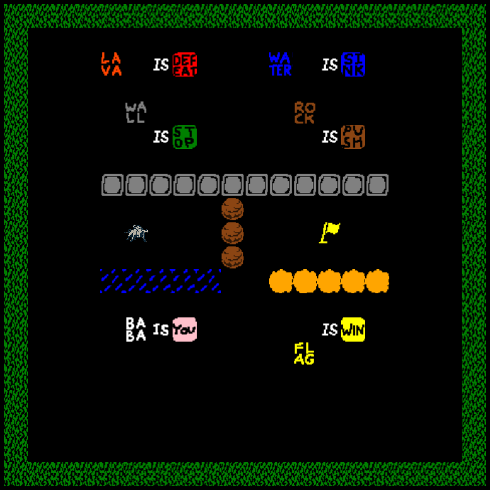

# BigBlueIsYou

## Description
Big Blue Is You is a fun imitation of the popular puzzle game, Baba Is You. Originating in 2017 at Nordic Game Jam, Baba Is You has become well-loved for its unique gameplay. Players set the rules of the game by manipulating tiles within the game arena.

## Adaptations
This version was developed in C# using the Monogame game engine framework. It utilizes an ECS model to support the dynamic nature of gameplay. "Baba" was changed to "Big Blue", the mascot of the best university on earth, Utah State University.

## Features I'm Most Proud Of
* Dynamic gameplay allows objects and their properties to be defined by players during gameplay
* Levels are read from a file, which allows for easy customization/addition of new levels
* Particle systems provide tasteful effects for notable in-game events
* Gameplay controls are customizeable from the main menu
* All sprites are animated, giving the gameplay arena a much less stagnant feel

## Build Instructions
1. Download Visual Studio
2. Launch the `.sln` file found in the root directory

## Gameplay Images

